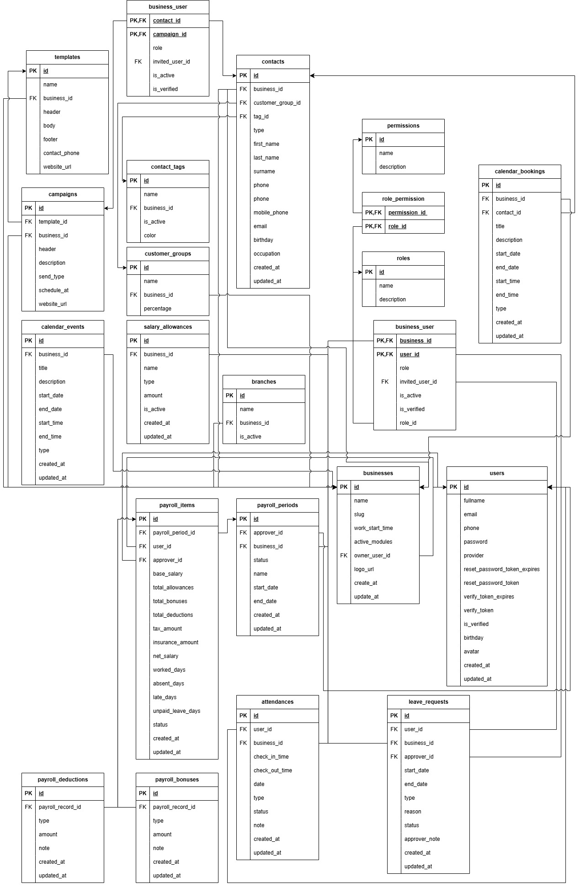

# REM Database Schema & Relationships



## Core Entities

### 1. **Users** (Core Authentication)

```sql
CREATE TABLE users (
    id UUID PRIMARY KEY,
    fullname VARCHAR(255) NOT NULL,
    email VARCHAR(255) UNIQUE NOT NULL,
    phone VARCHAR(20),
    password VARCHAR(255) NOT NULL,
    provider VARCHAR(50),
    reset_password_token VARCHAR(255),
    reset_password_token_expres TIMESTAMP,
    verify_token_expres TIMESTAMP,
    is_verified BOOLEAN DEFAULT false,
    birthday DATE,
    avatar VARCHAR(255),
    created_at TIMESTAMP DEFAULT CURRENT_TIMESTAMP,
    updated_at TIMESTAMP
);
```

- **Relationships**:
  - One-to-Many → `business_user` (user can be in multiple businesses)
  - One-to-Many → `attendances` (user has many attendance records)
  - One-to-Many → `leave_requests` (user makes many leave requests)
  - One-to-Many → `payroll_items` (payroll records for user)

---

### 2. **Businesses** (Workspaces/Organizations)

```sql
CREATE TABLE businesses (
    id UUID PRIMARY KEY,
    name VARCHAR(255) NOT NULL,
    slug VARCHAR(255) UNIQUE,
    work_start_time TIME,
    active_modules VARCHAR(255),
    owner_user_id UUID NOT NULL FOREIGN KEY REFERENCES users(id),
    logo_url VARCHAR(255),
    create_at TIMESTAMP DEFAULT CURRENT_TIMESTAMP,
    update_at TIMESTAMP
);
```

- **Relationships**:
  - Many-to-One ← `users` (one owner)
  - One-to-Many → `business_user` (business has many users with roles)
  - One-to-Many → `branches` (business has multiple branches)
  - One-to-Many → `contacts` (business has contacts)
  - One-to-Many → `campaigns` (business has campaigns)
  - One-to-Many → `calendar_events` (business has events)
  - One-to-Many → `attendances` (business tracks attendance)
  - One-to-Many → `leave_requests` (business manages leave)
  - One-to-Many → `payroll_periods` (business runs payroll)

---

### 3. **Business_User** (Multi-Tenant User-Business Mapping)

```sql
CREATE TABLE business_user (
    business_id UUID NOT NULL,
    user_id UUID NOT NULL,
    contact_id UUID FOREIGN KEY REFERENCES contacts(id),
    campaign_id UUID FOREIGN KEY REFERENCES campaigns(id),
    role_id UUID NOT NULL FOREIGN KEY REFERENCES roles(id),
    invited_user_id UUID FOREIGN KEY REFERENCES users(id),
    is_active BOOLEAN DEFAULT true,
    is_verified BOOLEAN DEFAULT false,
    PRIMARY KEY (business_id, user_id),
    FOREIGN KEY (business_id) REFERENCES businesses(id),
    FOREIGN KEY (user_id) REFERENCES users(id)
);
```

- **Purpose**: Junction table for multi-tenancy. Maps users to businesses with specific roles.
- **Relationships**:
  - Many-to-One → `businesses`
  - Many-to-One → `users`
  - Many-to-One → `roles`
  - Optional Many-to-One → `contacts` (user is also a contact)
  - Optional Many-to-One → `users.invited_user_id` (who invited this user)

---

### 4. **Roles** (Permission Sets)

```sql
CREATE TABLE roles (
    id UUID PRIMARY KEY,
    name VARCHAR(100) NOT NULL,
    description VARCHAR(255),
    created_at TIMESTAMP,
    updated_at TIMESTAMP
);
```

- **Relationships**:
  - One-to-Many → `business_user` (role assigned to users)
  - Many-to-Many → `permissions` (via `role_permission` junction table)

---

### 5. **Permissions** (Granular Access Control)

```sql
CREATE TABLE permissions (
    id UUID PRIMARY KEY,
    name VARCHAR(100) NOT NULL UNIQUE,
    description VARCHAR(255),
    created_at TIMESTAMP,
    updated_at TIMESTAMP
);
```

- **Format**: `resource.action` (e.g., `attendance.view`, `customer.create`)
- **Relationships**:
  - Many-to-Many ← `roles` (via `role_permission`)

---

### 6. **Role_Permission** (Permission Assignment to Roles)

```sql
CREATE TABLE role_permission (
    role_id UUID NOT NULL FOREIGN KEY REFERENCES roles(id),
    permission_id UUID NOT NULL FOREIGN KEY REFERENCES permissions(id),
    PRIMARY KEY (role_id, permission_id)
);
```

---

## CRM Module

### 7. **Contacts** (Customer/Prospect Database)

```sql
CREATE TABLE contacts (
    id UUID PRIMARY KEY,
    business_id UUID NOT NULL FOREIGN KEY REFERENCES businesses(id),
    customer_group_id UUID FOREIGN KEY REFERENCES customer_groups(id),
    tag_id UUID FOREIGN KEY REFERENCES contact_tags(id),
    type ENUM('PROSPECT', 'CUSTOMER', 'VENDOR', 'EMPLOYEE') NOT NULL,
    first_name VARCHAR(100),
    last_name VARCHAR(100),
    surname VARCHAR(100),
    phone VARCHAR(20),
    phone_secondary VARCHAR(20),
    mobile_phone VARCHAR(20),
    email VARCHAR(255),
    birthday DATE,
    occupation VARCHAR(100),
    created_at TIMESTAMP,
    updated_at TIMESTAMP
);
```

- **Relationships**:
  - Many-to-One → `businesses`
  - Many-to-One → `customer_groups`
  - Many-to-One → `contact_tags`

---

### 8. **Contact_Tags** (Tag Definitions)

```sql
CREATE TABLE contact_tags (
    id UUID PRIMARY KEY,
    name VARCHAR(100) NOT NULL,
    business_id UUID NOT NULL FOREIGN KEY REFERENCES businesses(id),
    is_active BOOLEAN DEFAULT true,
    color VARCHAR(20)
);
```

- **Relationships**:
  - Many-to-One → `businesses`
  - One-to-Many → `contacts`

---

### 9. **Customer_Groups** (Customer Segmentation)

```sql
CREATE TABLE customer_groups (
    id UUID PRIMARY KEY,
    name VARCHAR(100) NOT NULL,
    business_id UUID NOT NULL FOREIGN KEY REFERENCES businesses(id),
    percentage DECIMAL(5,2)
);
```

- **Relationships**:
  - Many-to-One → `businesses`
  - One-to-Many → `contacts`

---

### 10. **Campaigns** (Marketing Campaigns)

```sql
CREATE TABLE campaigns (
    id UUID PRIMARY KEY,
    template_id UUID FOREIGN KEY REFERENCES templates(id),
    business_id UUID NOT NULL FOREIGN KEY REFERENCES businesses(id),
    header VARCHAR(255),
    description VARCHAR(500),
    send_type ENUM('EMAIL', 'SMS', 'PUSH') NOT NULL,
    schedule_at TIMESTAMP,
    website_url VARCHAR(255),
    created_at TIMESTAMP,
    updated_at TIMESTAMP
);
```

- **Relationships**:
  - Many-to-One → `businesses`
  - Many-to-One → `templates` (optional)

---

### 11. **Templates** (Email/SMS Templates)

```sql
CREATE TABLE templates (
    id UUID PRIMARY KEY,
    name VARCHAR(100),
    business_id UUID NOT NULL FOREIGN KEY REFERENCES businesses(id),
    header VARCHAR(255),
    body TEXT NOT NULL,
    footer VARCHAR(255),
    contact_phone VARCHAR(20),
    website_url VARCHAR(255)
);
```

- **Relationships**:
  - Many-to-One → `businesses`
  - One-to-Many → `campaigns`

---

## ERP Module

### 12. **Branches** (Company Branches)

```sql
CREATE TABLE branches (
    id UUID PRIMARY KEY,
    name VARCHAR(100) NOT NULL,
    business_id UUID NOT NULL FOREIGN KEY REFERENCES businesses(id),
    is_active BOOLEAN DEFAULT true
);
```

- **Relationships**:
  - Many-to-One → `businesses`

---

### 13. **Salary_Allowances** (Salary Components)

```sql
CREATE TABLE salary_allowances (
    id UUID PRIMARY KEY,
    business_id UUID NOT NULL FOREIGN KEY REFERENCES businesses(id),
    name VARCHAR(100) NOT NULL,
    type ENUM('MEAL', 'TRANSPORT', 'HOUSING', 'PERFORMANCE') NOT NULL,
    amount DECIMAL(10,2),
    is_active BOOLEAN DEFAULT true,
    created_at TIMESTAMP,
    updated_at TIMESTAMP
);
```

- **Relationships**:
  - Many-to-One → `businesses`

---

## HRM Module

### 14. **Attendances** (Employee Attendance)

```sql
CREATE TABLE attendances (
    id UUID PRIMARY KEY,
    user_id UUID NOT NULL FOREIGN KEY REFERENCES users(id),
    business_id UUID NOT NULL FOREIGN KEY REFERENCES businesses(id),
    check_in_time TIMESTAMP,
    check_out_time TIMESTAMP,
    date DATE NOT NULL,
    type ENUM('PRESENT', 'ABSENT', 'LATE', 'LEAVE') NOT NULL,
    status ENUM('CHECKED_IN', 'CHECKED_OUT', 'ABSENT') NOT NULL,
    note TEXT,
    created_at TIMESTAMP,
    updated_at TIMESTAMP
);
```

- **Relationships**:
  - Many-to-One → `users`
  - Many-to-One → `businesses`

---

### 15. **Leave_Requests** (Leave Management)

```sql
CREATE TABLE leave_requests (
    id UUID PRIMARY KEY,
    user_id UUID NOT NULL FOREIGN KEY REFERENCES users(id),
    business_id UUID NOT NULL FOREIGN KEY REFERENCES businesses(id),
    approver_id UUID FOREIGN KEY REFERENCES users(id),
    start_date DATE NOT NULL,
    end_date DATE NOT NULL,
    type ENUM('ANNUAL', 'SICK', 'UNPAID', 'PARENTAL') NOT NULL,
    reason TEXT,
    status ENUM('PENDING', 'APPROVED', 'REJECTED') NOT NULL,
    approver_note VARCHAR(255),
    created_at TIMESTAMP,
    updated_at TIMESTAMP
);
```

- **Relationships**:
  - Many-to-One → `users` (requester)
  - Many-to-One → `users.approver_id` (approver)
  - Many-to-One → `businesses`

---

### 16. **Payroll_Periods** (Monthly/Period Payroll)

```sql
CREATE TABLE payroll_periods (
    id UUID PRIMARY KEY,
    approver_id UUID FOREIGN KEY REFERENCES users(id),
    business_id UUID NOT NULL FOREIGN KEY REFERENCES businesses(id),
    status ENUM('DRAFT', 'PROCESSING', 'APPROVED', 'PAID', 'CANCELLED') DEFAULT 'DRAFT',
    name VARCHAR(100),
    start_date DATE NOT NULL,
    end_date DATE NOT NULL,
    created_at TIMESTAMP,
    updated_at TIMESTAMP
);
```

- **Relationships**:
  - Many-to-One → `businesses`
  - Optional Many-to-One → `users` (approver)
  - One-to-Many → `payroll_items`

---

### 17. **Payroll_Items** (Individual Payroll Records)

```sql
CREATE TABLE payroll_items (
    id UUID PRIMARY KEY,
    payroll_period_id UUID NOT NULL FOREIGN KEY REFERENCES payroll_periods(id),
    user_id UUID NOT NULL FOREIGN KEY REFERENCES users(id),
    approver_id UUID FOREIGN KEY REFERENCES users(id),
    base_salary DECIMAL(12,2) NOT NULL,
    total_allowances DECIMAL(10,2) DEFAULT 0,
    total_bonuses DECIMAL(10,2) DEFAULT 0,
    total_deductions DECIMAL(10,2) DEFAULT 0,
    tax_amount DECIMAL(10,2) DEFAULT 0,
    insurance_amount DECIMAL(10,2) DEFAULT 0,
    net_salary DECIMAL(12,2),
    worked_days INT,
    absent_days INT,
    late_days INT,
    unpaid_leave_days INT,
    status ENUM('DRAFT', 'PENDING', 'APPROVED', 'PAID') DEFAULT 'DRAFT',
    created_at TIMESTAMP,
    updated_at TIMESTAMP
);
```

- **Relationships**:
  - Many-to-One → `payroll_periods`
  - Many-to-One → `users`
  - Optional Many-to-One → `users.approver_id`
  - One-to-Many → `payroll_bonuses`
  - One-to-Many → `payroll_deductions`

---

### 18. **Payroll_Bonuses** (Bonus Records)

```sql
CREATE TABLE payroll_bonuses (
    id UUID PRIMARY KEY,
    payroll_record_id UUID NOT NULL FOREIGN KEY REFERENCES payroll_items(id),
    type ENUM('PERFORMANCE', 'HOLIDAY', 'ATTENDANCE') NOT NULL,
    amount DECIMAL(12,2) NOT NULL,
    note TEXT,
    created_at TIMESTAMP,
    updated_at TIMESTAMP
);
```

- **Relationships**:
  - Many-to-One → `payroll_items`

---

### 19. **Payroll_Deductions** (Deduction Records)

```sql
CREATE TABLE payroll_deductions (
    id UUID PRIMARY KEY,
    payroll_record_id UUID NOT NULL FOREIGN KEY REFERENCES payroll_items(id),
    type ENUM('TAX', 'INSURANCE', 'LATE', 'ABSENT') NOT NULL,
    amount DECIMAL(12,2) NOT NULL,
    note TEXT,
    created_at TIMESTAMP,
    updated_at TIMESTAMP
);
```

- **Relationships**:
  - Many-to-One → `payroll_items`

---

## Calendar Module

### 20. **Calendar_Events** (Business Events)

```sql
CREATE TABLE calendar_events (
    id UUID PRIMARY KEY,
    business_id UUID NOT NULL FOREIGN KEY REFERENCES businesses(id),
    title VARCHAR(255) NOT NULL,
    description TEXT,
    start_date DATE NOT NULL,
    end_date DATE NOT NULL,
    start_time TIME,
    end_time TIME,
    type ENUM('MEETING', 'HOLIDAY', 'DEADLINE', 'OTHER') NOT NULL,
    created_at TIMESTAMP,
    updated_at TIMESTAMP
);
```

- **Relationships**:
  - Many-to-One → `businesses`
  - One-to-Many → `calendar_bookings`

---

### 21. **Calendar_Bookings** (Booking Reservations)

```sql
CREATE TABLE calendar_bookings (
    id UUID PRIMARY KEY,
    business_id UUID NOT NULL FOREIGN KEY REFERENCES businesses(id),
    contact_id UUID FOREIGN KEY REFERENCES contacts(id),
    title VARCHAR(255),
    description TEXT,
    start_date DATE,
    end_date DATE,
    start_time TIME,
    end_time TIME,
    type ENUM('CONSULTATION', 'MEETING', 'SERVICE') NOT NULL,
    created_at TIMESTAMP,
    updated_at TIMESTAMP
);
```

- **Relationships**:
  - Many-to-One → `businesses`
  - Many-to-One → `contacts`

---

## Relationship Summary

```markdown
┌─────────────────────────────────────────────────────────┐
│                    CORE ENTITIES                        │
├─────────────────────────────────────────────────────────┤
│ users (1) ──→ (M) business_user ←── (1) businesses      │
│          ↓                                      ↓       │
│      Multiple roles,                  Multiple modules  │
│  permissions, branches                                  │
└─────────────────────────────────────────────────────────┘

┌──────────── CRM MODULE ──────────┐
│  contacts ← business             │
│  contact_tags ← business         │
│  customer_groups ← business      │
│  campaigns ← business, templates │
└──────────────────────────────────┘

┌──────────── ERP MODULE ──────────┐
│  branches ← business             │
│  salary_allowances ← business    │
│  calendar_events ← business      │
│  calendar_bookings ← business    │
└──────────────────────────────────┘

┌──────────── HRM MODULE ──────────┐
│  attendances ← users, business   │
│  leave_requests ← users, business│
│  payroll_periods ← business      │
│  payroll_items ← users, periods  │
│  bonuses → payroll_items         │
│  deductions → payroll_items      │
└──────────────────────────────────┘
```
